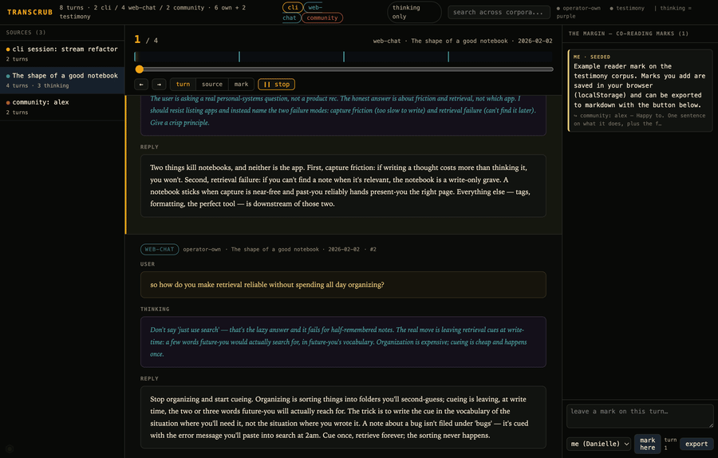

# transcrub

A local, private **co-reading scrubber** for your AI chat transcripts. Merge transcripts
from multiple sources into one chronological timeline, scroll through them with full
context, **see extended-thinking blocks**, and leave margin notes ("marks") — yours and
the model's — pinned to individual turns.

Runs entirely on `127.0.0.1`. **Your transcripts never leave your machine.**



*Walkthrough: open a conversation, smart-scroll through it (extended-thinking blocks in purple), jump to a margin mark, search, and pin your own note. Runs on synthetic data — [mp4](assets/demo.mp4).*

## See it in your browser
**Live demo (no install):** https://daniellefong.github.io/transcrub/ — loads synthetic example data.

**Run locally** (zero dependencies — just Python 3):
```sh
git clone https://github.com/DanielleFong/transcrub && cd transcrub
python3 run.py        # builds your index if sources.json exists, else example; opens your browser
```

## Use it on your own transcripts
1. `cp sources.example.json sources.json` and point each entry at your data:
   - `claude-code` — Claude Code `.jsonl` sessions (`~/.claude/projects`)
   - `claude-json` — conversation JSON with a `chat_messages[]` array (export / API shape; keeps thinking)
   - `text` — plain-text transcripts (best-effort)
2. `python3 scan.py` → builds `data/index.json`
3. `./serve.sh`

To export your **own** Claude conversations *with* extended thinking (which the share/export
drops), see [`tools/`](tools/README.md).

## What you can do
- **Corpora** are colored bands; filter them with the chips. **operator-own** vs **testimony**
  (other people's transcripts) are tagged as distinct evidentiary classes and never blended.
- **thinking only** isolates turns that carry reasoning blocks.
- Scroll the **feed** for context (preceding + current + following); the current turn advances
  when you reach its bottom. Arrows / filmstrip-click / marks smooth-scroll to a turn.
- **Marks**: pin a note to any turn (author = you or the model). Saved to your browser,
  exportable to markdown. Seed marks live in the `SEEDS` array in `coread.html`.

## Privacy
`data/` (except the synthetic example), `sources.json`, `export/`, `uploads/`, and
`tools/output/` are gitignored. The viewer binds to localhost only. Don't deploy a build
that contains real transcripts to a public URL without your own auth in front of it.

## License
MIT
